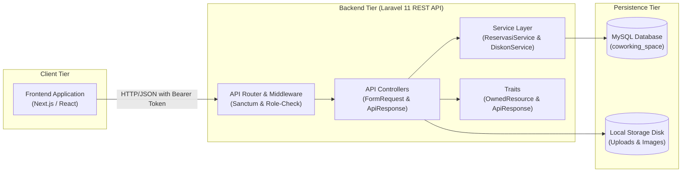
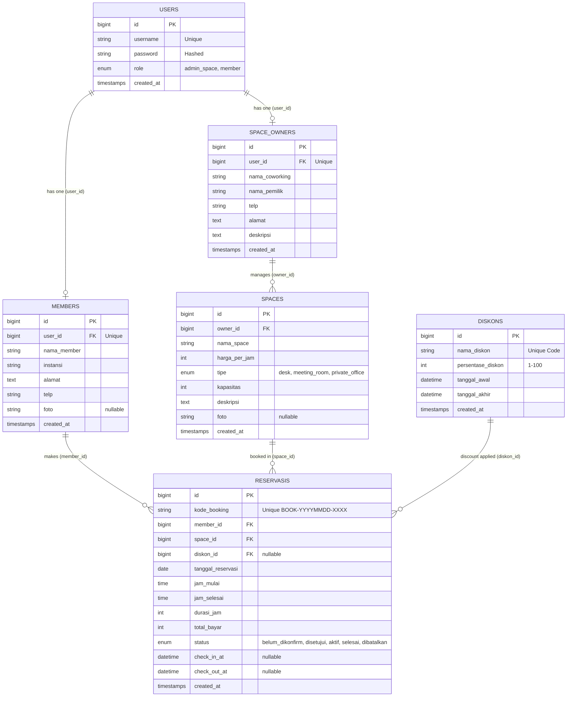
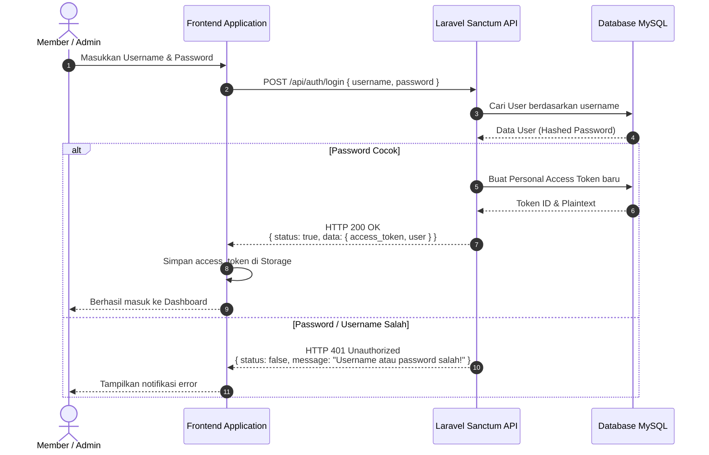
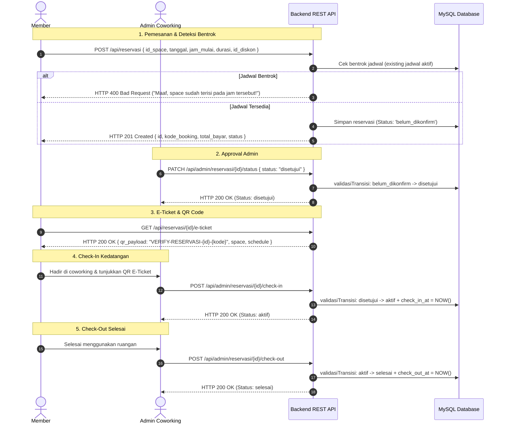
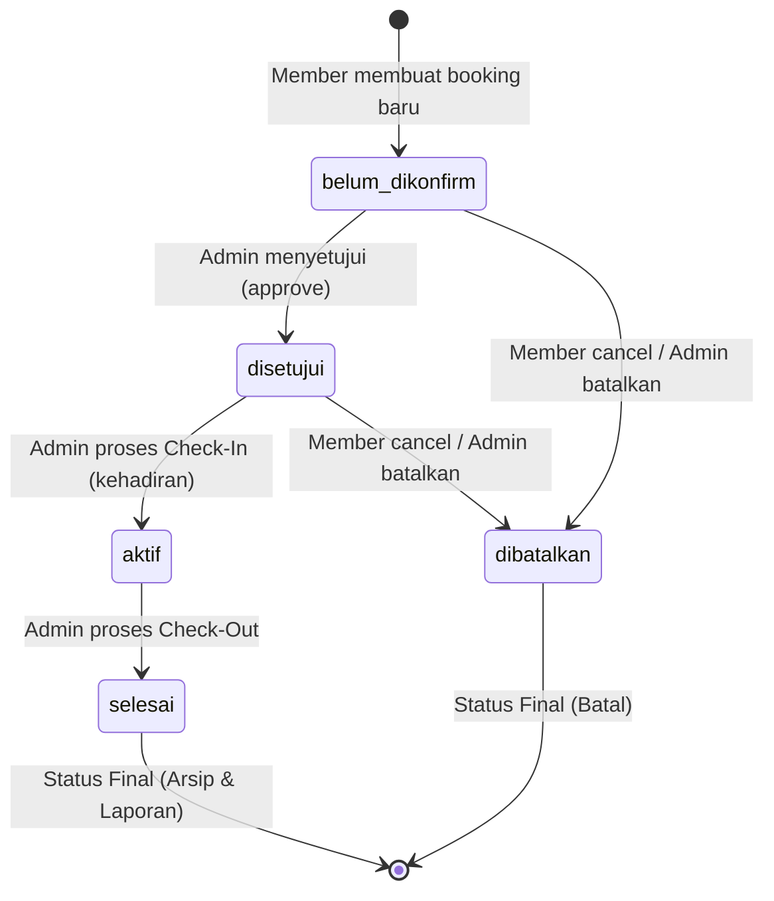
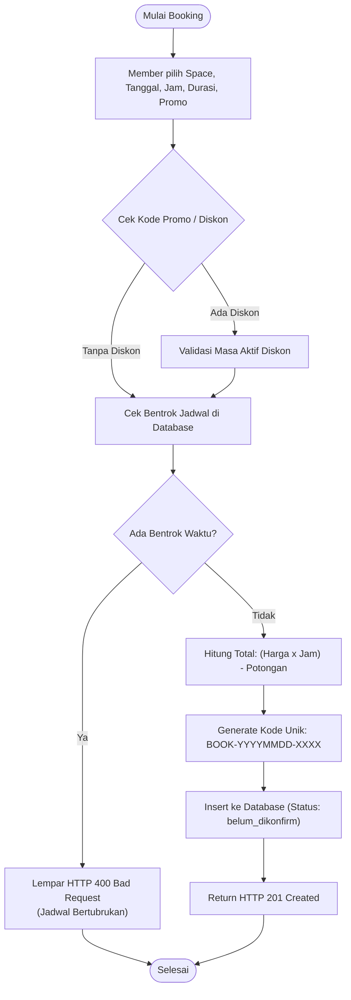

# 🏢 Smart Space Booking — RESTful Backend API
> **Uji Kompetensi Keahlian (UKK) Rekayasa Perangkat Lunak 2026/2027 — Paket B**  
> Sistem Reservasi Coworking Space Cerdas berbasis RESTful API dengan Laravel 11, Laravel Sanctum, dan MySQL.

---

## 🚀 Tech Stack

| Komponen | Teknologi | Keterangan |
|---|---|---|
| **Framework** | Laravel 11 (PHP 8.2+) | RESTful API Architecture |
| **Authentication** | Laravel Sanctum | Stateful & Bearer Token Authentication |
| **Database** | MySQL 8.0+ / MariaDB | Relational Database (`coworking_space`) |
| **Testing Suite** | Pest PHP 3.x / PHPUnit 11 | 42 Automated Feature & Unit Tests (100% PASS) |
| **E2E Smoke Test**| Bash + cURL + jq | Automated 50 Test Cases covering all 46 API routes |
| **Code Style** | PSR-12 / Laravel Pint | Ponytail Clean & Lean Engineering |

---

## 🔑 Akun Demo (Default Seeder)

Database seeder menyediakan akun siap pakai dengan data space, diskon, dan reservasi:

| Peran | Username | Password | Keterangan |
|---|---|---|---|
| **Admin Space** | `admin_demo` | `Admin123!` | Pengelola Moklet Hub Coworking Space |
| **Member 1** | `budi.member` | `Member123!` | Member Budi Raharjo (SMK Telkom Malang) |
| **Member 2** | `siti.member` | `Member123!` | Member Siti Nurhaliza (Universitas Brawijaya) |
| **Member 3** | `agus.member` | `Member123!` | Member Agus Salim (PT Maju Teknologi) |

---

## ⚙️ Panduan Instalasi & Menjalankan

Ikuti langkah-langkah berikut untuk menjalankan backend di lingkungan lokal:

### 1. Clone & Masuk ke Folder Proyek
```bash
cd /path/to/UKK/paketb-backend
```

### 2. Install Dependensi PHP
```bash
composer install
```

### 3. Konfigurasi Environment File
Salin template environment:
```bash
cp .env.example .env
```

### 4. Generate Application Key
```bash
php artisan key:generate
```

### 5. Konfigurasi Database & Storage Link
Pastikan MySQL sudah berjalan, lalu buat database `coworking_space`:
```bash
mysql -u root -e "CREATE DATABASE IF NOT EXISTS coworking_space CHARACTER SET utf8mb4 COLLATE utf8mb4_unicode_ci;"
mysql -u root -e "CREATE DATABASE IF NOT EXISTS coworking_space_test CHARACTER SET utf8mb4 COLLATE utf8mb4_unicode_ci;"
```
Jalankan migrasi database dan seed data demo:
```bash
php artisan migrate:fresh --seed
php artisan storage:link
```

### 6. Jalankan Server Pengembangan
```bash
php artisan serve --port=8000
```
API siap diakses pada: `http://localhost:8000/api`

---

## 🔧 Konfigurasi Environment (`.env`)

Snippet konfigurasi penting pada file `.env`:

```env
APP_NAME="Smart Space Booking"
APP_ENV=local
APP_KEY=base64:...
APP_DEBUG=true
APP_URL=http://localhost:8000

DB_CONNECTION=mysql
DB_HOST=127.0.0.1
DB_PORT=3306
DB_DATABASE=coworking_space
DB_USERNAME=root
DB_PASSWORD=

SESSION_DRIVER=database
FILESYSTEM_DISK=public
SANCTUM_STATEFUL_DOMAINS=localhost:3000,127.0.0.1:3000
```

---

## 🏛️ Arsitektur Sistem

Sistem memisahkan tanggung jawab antara antarmuka web, logika bisnis API backend, dan layer persistensi data secara tegas.



---

## 🗄️ Database ERD (Entity Relationship Diagram)

Skema database terdiri dari 6 entitas utama dengan relasi relasional terindeks:



---

## 🔐 Alur Autentikasi (Sanctum Token)

Sistem menggunakan autentikasi token Bearer berbasis Laravel Sanctum untuk mengamankan endpoint privat.



---

## 📅 Alur Reservasi Lengkap (Full Lifecycle Flow)

Alur komprehensif mulai dari reservasi, proteksi bentrok, approval admin, QR E-Ticket, check-in, hingga check-out:



---

## 🔄 State Machine Status Reservasi

Status reservasi dikontrol menggunakan finite-state machine yang divalidasi oleh `ReservasiService::validasiTransisi`:



---

## 📊 Alur Logika Bisnis (Flowcharts)

### Alur Pemesanan & Perhitungan Harga


### Alur Validasi Check-In Admin
```mermaid
flowchart TD
    A1(["Scan QR / Pilih Reservasi"]) --> B1["Admin Request POST /api/admin/reservasi/{id}/check-in"]
    B1 --> C1{"Cek Kepemilikan Space Admin"}
    C1 -->|Bukan Milik Admin| D1["Return HTTP 404 Not Found"]
    C1 -->|Valid Milik Admin| E1{"Status Saat Ini == 'disetujui'?"}
    E1 -->|Tidak (cth: belum_dikonfirm / aktif)| F1["Return HTTP 400 Bad Request<br/>(Transisi Ditolak)"]
    E1 -->|Ya| G1["Update Status = 'aktif' & check_in_at = NOW()"]
    G1 --> H1["Return HTTP 200 OK (Check-In Berhasil)"]
    D1 --> Z1(["Selesai"])
    F1 --> Z1
    H1 --> Z1
```

---

## 📦 Standar Format Response API

Semua endpoint mengimplementasikan struktur response JSON yang seragam (`ApiResponse` trait):

### Response Sukses (200 OK / 201 Created)
```json
{
  "status": true,
  "statusCode": 200,
  "message": "Berhasil memproses permintaan",
  "data": {
    "id": 1,
    "nama_space": "Personal Desk - Flexi 01",
    "harga_per_jam": 20000
  },
  "timestamp": "2026-09-04T15:48:50+00:00"
}
```

### Response Error Validasi (422 Unprocessable Content)
```json
{
  "status": false,
  "statusCode": 422,
  "message": "Validasi gagal",
  "error": "Validation Error",
  "data": {
    "id_space": ["Space wajib dipilih"],
    "durasi_jam": ["Durasi minimal 1 jam"]
  },
  "timestamp": "2026-09-04T15:48:50+00:00"
}
```

### Response Error Bisnis / Konflik (400 Bad Request)
```json
{
  "status": false,
  "statusCode": 400,
  "message": "Maaf, space sudah terisi atau dibooking pada jam tersebut!",
  "error": "Bad Request",
  "timestamp": "2026-09-04T15:48:50+00:00"
}
```

---

## 📋 Daftar Lengkap Endpoint API (46 Routes)

### 1. Public Base & Health
| Method | Endpoint | Role | Deskripsi |
|---|---|---|---|
| `GET` | `/api` | Public | Informasi metadata backend API |
| `GET` | `/api/health` | Public | Healthcheck service status |

### 2. Autentikasi
| Method | Endpoint | Role | Deskripsi |
|---|---|---|---|
| `POST` | `/api/auth/register/member` | Public | Registrasi akun member baru |
| `POST` | `/api/auth/register/admin-space` | Public | Registrasi admin & profil coworking |
| `POST` | `/api/auth/login` | Public | Login akun & peroleh Sanctum token |
| `GET` | `/api/auth/profile` | Authenticated | Mendapatkan data profil user yang login |
| `POST` | `/api/auth/logout` | Authenticated | Revoke token dan logout sesi |

### 3. Katalog Space (Publik)
| Method | Endpoint | Role | Deskripsi |
|---|---|---|---|
| `GET` | `/api/spaces` | Public | Daftar semua coworking space (filter tipe, search) |
| `GET` | `/api/spaces/{id}` | Public | Detail space beserta fasilitas & owner |
| `GET` | `/api/spaces/availability` | Public | Cek ketersediaan slot waktu space |
| `GET` | `/api/spaces/types` | Public | Daftar opsi tipe ruangan (desk, meeting, office) |

### 4. Promo & Diskon (Publik)
| Method | Endpoint | Role | Deskripsi |
|---|---|---|---|
| `GET` | `/api/diskon/active` | Public | Daftar promo diskon yang sedang aktif |
| `POST` | `/api/diskon/check` | Public | Validasi keabsahan kode promo |
| `GET` | `/api/diskon/{id}` | Public | Detail persentase dan periode diskon |

### 5. Reservasi (Member)
| Method | Endpoint | Role | Deskripsi |
|---|---|---|---|
| `POST` | `/api/reservasi` | Member | Membuat booking baru (validasi bentrok & harga) |
| `GET` | `/api/reservasi/my` | Member | Daftar reservasi aktif milik member |
| `GET` | `/api/reservasi/my/history` | Member | Riwayat reservasi & kalkulasi total pengeluaran |
| `GET` | `/api/reservasi/{id}` | Member/Admin | Detail lengkap informasi reservasi |
| `PATCH` | `/api/reservasi/{id}/cancel` | Member | Membatalkan reservasi (sebelum aktif) |
| `GET` | `/api/reservasi/{id}/e-ticket` | Member/Admin | Data E-Ticket & string payload QR Code |

### 6. Admin Coworking Profile
| Method | Endpoint | Role | Deskripsi |
|---|---|---|---|
| `GET` | `/api/admin/profile` | Admin Space | Melihat profil detail coworking space yang dikelola |
| `PUT` | `/api/admin/profile` | Admin Space | Memperbarui nama, alamat, telp, dan deskripsi coworking |

### 7. Admin Spaces Management (CRUD)
| Method | Endpoint | Role | Deskripsi |
|---|---|---|---|
| `GET` | `/api/admin/spaces` | Admin Space | List semua ruangan milik coworking admin |
| `POST` | `/api/admin/spaces` | Admin Space | Tambah ruangan / meja baru |
| `GET` | `/api/admin/spaces/{id}` | Admin Space | Detail spesifik ruangan milik admin |
| `PUT` | `/api/admin/spaces/{id}` | Admin Space | Update kapasitas, harga, atau deskripsi space |
| `DELETE` | `/api/admin/spaces/{id}` | Admin Space | Hapus space (hanya jika tidak ada booking aktif) |

### 8. Admin Members Management (CRUD)
| Method | Endpoint | Role | Deskripsi |
|---|---|---|---|
| `GET` | `/api/admin/members` | Admin Space | List seluruh data member terdaftar |
| `POST` | `/api/admin/members` | Admin Space | Tambah member secara manual oleh admin |
| `GET` | `/api/admin/members/{id}` | Admin Space | Detail member beserta instansi dan kontak |
| `PUT` | `/api/admin/members/{id}` | Admin Space | Update data member |
| `DELETE` | `/api/admin/members/{id}` | Admin Space | Hapus member dari sistem |

### 9. Admin Diskon Management (CRUD)
| Method | Endpoint | Role | Deskripsi |
|---|---|---|---|
| `GET` | `/api/admin/diskon` | Admin Space | List semua kode promo diskon |
| `POST` | `/api/admin/diskon` | Admin Space | Buat kupon promo diskon baru |
| `GET` | `/api/admin/diskon/{id}` | Admin Space | Detail diskon |
| `PUT` | `/api/admin/diskon/{id}` | Admin Space | Update persentase atau masa berlaku promo |
| `DELETE` | `/api/admin/diskon/{id}` | Admin Space | Hapus kode promo |

### 10. Admin Reservasi Management & Lifecycle
| Method | Endpoint | Role | Deskripsi |
|---|---|---|---|
| `GET` | `/api/admin/reservasi` | Admin Space | List booking reservasi untuk coworking milik admin |
| `PATCH` | `/api/admin/reservasi/{id}/status` | Admin Space | Approve atau tolak booking (`disetujui`/`dibatalkan`) |
| `POST` | `/api/admin/reservasi/{id}/check-in` | Admin Space | Check-in kehadiran member saat tiba (`aktif`) |
| `POST` | `/api/admin/reservasi/{id}/check-out` | Admin Space | Check-out member saat durasi selesai (`selesai`) |

### 11. Admin Reports & Analytics
| Method | Endpoint | Role | Deskripsi |
|---|---|---|---|
| `GET` | `/api/admin/reports/monthly` | Admin Space | Laporan okupansi dan statistik bulanan |
| `GET` | `/api/admin/reports/income` | Admin Space | Rekapitulasi total pendapatan per periode |

### 12. Media & Image Uploads
| Method | Endpoint | Role | Deskripsi |
|---|---|---|---|
| `POST` | `/api/upload/image` | Authenticated | Upload gambar umum |
| `POST` | `/api/upload/members` | Authenticated | Upload avatar foto member |
| `POST` | `/api/upload/spaces` | Admin Space | Upload foto galeri space coworking |

---

## ❓ Format Tanya Jawab (Q&A)

**Q: Mengapa registrasi dan login menggunakan `username` bukan `email`?**  
*A: Sesuai dengan spesifikasi dokumen resmi Uji Kompetensi Keahlian (UKK) RPL 2026/2027 Paket B, atribut pengguna primer adalah `username`. Validasi keunikan username diterapkan langsung di layer database dan FormRequest.*

**Q: Bagaimana mekanisme render QR Code pada E-Ticket?**  
*A: Backend mengirimkan string payload terstandarisasi (contoh: `VERIFY-RESERVASI-8-BOOK-20260920-0076`) pada endpoint `/api/reservasi/{id}/e-ticket`. Frontend Next.js me-render QR Code langsung di sisi klien menggunakan komponen seperti `qrcode.react` tanpa membebani storage server dengan file gambar QR statis.*

**Q: Bagaimana cara kerja proteksi bentrok jadwal?**  
*A: Backend mengevaluasi relasi waktu: `(existing.jam_mulai < new.jam_selesai) AND (new.jam_mulai < existing.jam_selesai)` untuk reservasi pada space dan tanggal yang sama dengan status bukan `dibatalkan`. Jika ditemukan overlap, request langsung ditolak dengan HTTP 400 Bad Request.*

---

## 📁 Struktur Folder Proyek

```text
paketb-backend/
├── app/
│   ├── Http/
│   │   ├── Controllers/Api/     # REST API Controllers (Admin, Auth, Space, Reservasi)
│   │   ├── Requests/            # FormRequest Validations (Indonesian error messages)
│   │   └── Resources/           # API Resource Transformers (JSON Formatting)
│   ├── Models/                  # Eloquent Models (User, Member, Space, Reservasi, Diskon)
│   ├── Services/                # ReservasiService (State Machine) & DiskonService
│   └── Traits/                  # ApiResponse & OwnedResource Helpers
├── database/
│   ├── factories/               # Model factories untuk testing
│   ├── migrations/              # Database schema migrations
│   └── seeders/                 # DatabaseSeeder (Akun demo & data awal)
├── postman/                     # Koleksi Postman resmi untuk testing API
├── routes/
│   └── api.php                  # Seluruh 46 definisi endpoint API
└── tests/
    ├── Feature/                 # 42 Pest PHP Feature Tests
    └── e2e/                     # Automated Smoke Test Suite (smoke.sh & RESULT.md)
```

---

## 🧪 Pengujian Otomatis (Automated Testing)

### 1. Unit & Feature Testing (Pest PHP)
Sistem memiliki 42 automated tests yang memvalidasi seluruh flow autentikasi, registrasi, hak akses per role, diskon, reservasi, transisi status, hingga proteksi jadwal bentrok.

Jalankan test suite:
```bash
php artisan test --compact
```
Hasil:
```text
✓ tests/Feature/AdminDiskonTest.php
✓ tests/Feature/AdminMemberTest.php
✓ tests/Feature/AdminReportTest.php
✓ tests/Feature/AdminReservasiTest.php
✓ tests/Feature/AdminSpaceTest.php
✓ tests/Feature/AuthTest.php
✓ tests/Feature/DiskonTest.php
✓ tests/Feature/ReservasiTest.php
✓ tests/Feature/SpaceTest.php

Tests:    42 passed (116 assertions)
Duration: 1.24s
```

### 2. End-to-End (E2E) Smoke Test
Script bash yang secara otomatis mereset database, memverifikasi server, dan mengeksekusi HTTP cURL ke **seluruh 46 endpoint**:
```bash
bash tests/e2e/smoke.sh
```
Hasil: **50/50 PASS** (Tersimpan otomatis di [`tests/e2e/RESULT.md`](tests/e2e/RESULT.md)).

---

## 📮 Koleksi Postman

File koleksi Postman lengkap tersedia di:  
[`postman/smart-space-booking.postman_collection.json`](postman/smart-space-booking.postman_collection.json)

### Cara Import ke Postman:
1. Buka Postman -> Klik tombol **Import**.
2. Pilih file `postman/smart-space-booking.postman_collection.json`.
3. Buat Environment baru dengan variabel:
   - `base_url`: `http://localhost:8000/api`
   - `token`: (Otomatis terisi setelah eksekusi request Login).
